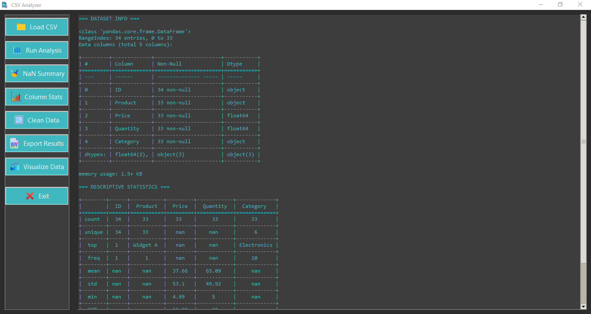
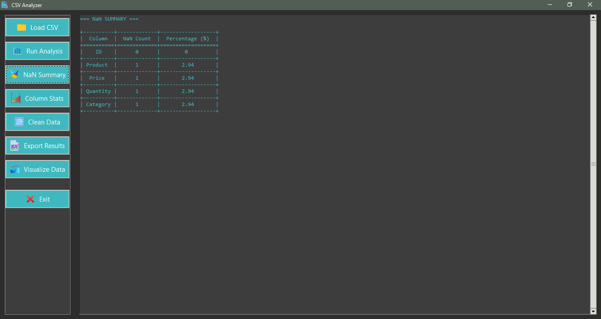
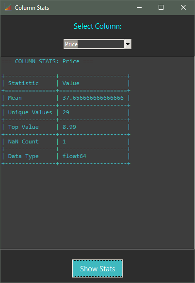
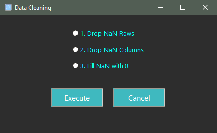
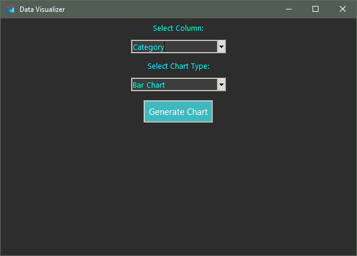
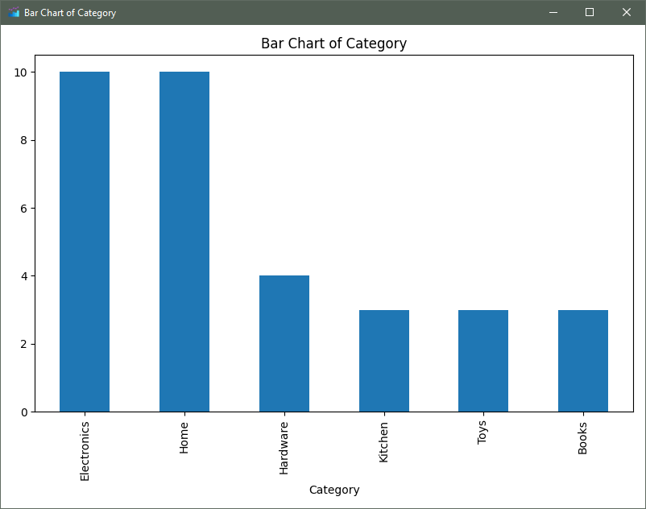

# CSV Analyzer

`CSV Analyzer` is a lightweight desktop GUI application built with Python and Tkinter. It allows users to quickly load, inspect, visualize, and export insights from CSV files — all without writing a single line of code. It's built for data analysts, students, and anyone working with tabular data.

---

## Features

- **Load and preview** any CSV file via a graphical interface
- **Instantly view key metadata:** number of rows/columns, column names, and data types
- **Get descriptive statistics** (mean, min, max, std, etc.) for each column
- **Count and display** missing (NaN) values across the dataset
- **Column wise stats:** For any selected column, view data type, non-null count, unique value count, most frequent (mode) value, min/max value (for numeric columns)
- **Data cleaning tool:** Instantly fill all NaN values with 0, drop rows/columns with any NaN values
- **Data visualization:** View bar plot for categories, pie chart of distributions, histogram for numeric columns
- **Export results:** Save analysis report of current window to a txt or csv file
- **Fully local —** no data is sent or stored externally

---

## Screenshots

|              App UI               |            Data Analysis            |          NaN Summary           |
|:---------------------------------:|:-----------------------------------:|:------------------------------:|
|  |  |  |

|          Column Statistics           |          Data Cleaning           |           Data Visualizer            |
|:------------------------------------:|:--------------------------------:|:------------------------------------:|
|  |  |  |

|              Bar Chart               |
|:------------------------------------:|
|  |

---

## Requirements

Install the required packages using:

```bash
pip install -r requirements.txt
```

Contents of `requirements.txt`:
```
pandas
matplotlib
tabulate
```

---

## How to Run

1. Clone the repository:
   ```bash
   git clone https://github.com/AyaanNadeem12/CSV-Analyzer.git
   cd csv-analyzer
   ```

2. Install the dependencies:
   ```bash
   pip install -r requirements.txt
   ```

3. Run the app:
   ```bash
   python main.py
   ```

> Ensure Python 3.8 or above is installed on your system.

---

## Project Structure

```
CSV-Analyzer/
├── main.py                # Main application file
├── requirements.txt       # Python dependencies
├── README.md              # Project documentation
├── assets/                # Icons, screenshots
└── .gitignore             # Files/folders to exclude from Git
```

---

## Roadmap

Planned features for future versions:

- [ ] “Top N frequent values” analysis for selected columns
- [ ] Column filtering by data type (numeric, object, etc.)
- [ ] Support for Excel (.xlsx) files
- [ ] Correlation heatmaps
- [ ] Drag-and-drop CSV support
- [ ] Column-specific cleaning tools

---

## License

This project is open-source and available under the [MIT License](LICENSE).

---

## Acknowledgements

Built using:
- [Tkinter](https://docs.python.org/3/library/tkinter.html)
- [pandas](https://pandas.pydata.org/)
- [matplotlib](https://matplotlib.org/)
- [tabulate](https://pypi.org/project/tabulate/)
